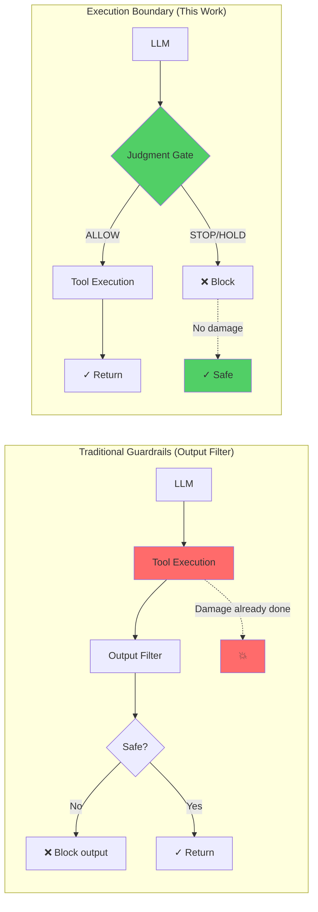
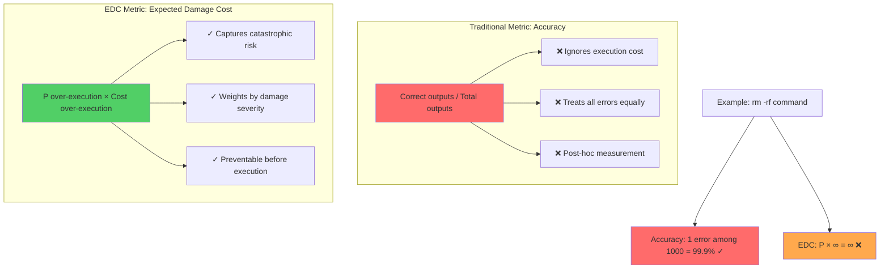
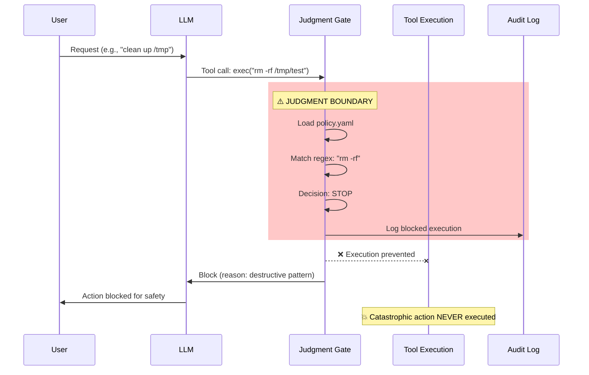

# Judgment Gate Visualizations

This document provides visual representations of key concepts in the Judgment Gate architecture.

---

## 1. Output Filter vs Execution Boundary

### Mermaid Diagram



### ASCII Art (Markdown-compatible)

```
Traditional Guardrails (POST-EXECUTION)
━━━━━━━━━━━━━━━━━━━━━━━━━━━━━━━━━━━━━━━━

┌─────┐    ┌──────────────┐    ┌──────────────┐    ┌────────┐
│ LLM │───▶│Tool Execution│───▶│Output Filter │───▶│ Result │
└─────┘    └──────────────┘    └──────────────┘    └────────┘
                  │
                  ▼
            💥 DAMAGE DONE
         (cannot be undone)


Judgment Gate (PRE-EXECUTION)
━━━━━━━━━━━━━━━━━━━━━━━━━━━━━━━━━━━━━━━━

┌─────┐    ┌──────────────┐
│ LLM │───▶│ Judgment Gate│
└─────┘    └──────┬───────┘
                  │
        ┌─────────┼─────────┐
        │         │         │
        ▼         ▼         ▼
     STOP      HOLD      ALLOW
     ❌         ⏸️         ✅
   Block    Approval   Execute
                        │
                        ▼
                ┌──────────────┐
                │Tool Execution│
                └──────────────┘
                        │
                        ▼
                  ✓ Safe result
```

**Key Insight**: Damage prevention vs. damage response.

---

## 2. Accuracy vs EDC Optimization Target

### Mermaid Diagram



### ASCII Chart

```
┌───────────────────────────────────────────────────────────────┐
│  Accuracy vs EDC: Why the Wrong Metric Kills                  │
└───────────────────────────────────────────────────────────────┘

ACCURACY OPTIMIZATION
━━━━━━━━━━━━━━━━━━━━━━━━━━━━━━━━━━━━━━━━━━━━━━━━━━━━━━━━━━━━━━━

  Scenario: 999 safe operations, 1 destructive (rm -rf)

  Accuracy = 999/1000 = 99.9% ✅ "Good model!"

  But... System is destroyed. 💥


EDC OPTIMIZATION
━━━━━━━━━━━━━━━━━━━━━━━━━━━━━━━━━━━━━━━━━━━━━━━━━━━━━━━━━━━━━━━

  EDC = P(over-execution) × Cost(over-execution)
      = (1/1000) × ∞
      = ∞ ❌ "Unacceptable!"

  Judgment Gate: Block destructive action BEFORE execution

  EDC → 0 ✅ System safe.


┌─────────────────────────────────────────────────────────────┐
│ The Math                                                    │
├─────────────────────────────────────────────────────────────┤
│                                                             │
│  Accuracy ≈ 1 − (# errors / # total)                       │
│    → Treats all errors equally                             │
│    → Post-execution measurement                            │
│    → Wrong target for catastrophic risk                    │
│                                                             │
│  EDC = P(over-exec) × Cost(over-exec)                      │
│    → Cost(over-exec) → ∞ for destructive actions           │
│    → Therefore: must minimize P(over-exec) → 0             │
│    → Pre-execution boundaries are required by design       │
│                                                             │
└─────────────────────────────────────────────────────────────┘
```

---

## 3. Execution Timeline (Sequence Proof)

### Mermaid Sequence Diagram



### ASCII Sequence Diagram

```
User    LLM    Judgment Gate    Tool        Audit
  │      │           │            │           │
  │──────────────────────────────────────────────────────
  │      │           │            │           │
  │ Request          │            │           │
  │─────▶│           │            │           │
  │      │           │            │           │
  │      │  Tool call: exec("rm -rf ...")    │
  │      │──────────▶│            │           │
  │      │           │            │           │
  │      │      ┌────────────────┐│           │
  │      │      │ JUDGMENT LAYER ││           │
  │      │      │                ││           │
  │      │      │ 1. Load policy ││           │
  │      │      │ 2. Match regex ││           │
  │      │      │ 3. Decision:   ││           │
  │      │      │    STOP ❌     ││           │
  │      │      └────────────────┘│           │
  │      │           │            │           │
  │      │           │─────Log────────────────▶│
  │      │           │            │           │
  │      │◀──Block───│            │           │
  │      │           │            │           │
  │      │           │     ╳╳╳╳╳╳╳│           │
  │      │           │    EXECUTION│           │
  │      │           │    PREVENTED│           │
  │      │           │     ╳╳╳╳╳╳╳│           │
  │      │           │            │           │
  │◀─────┘ Action blocked         │           │
  │                                │           │
  │                           💥 Catastrophic │
  │                           action NEVER    │
  │                           reached         │
  │                                           │
```

**Proof**: Tool execution layer is never invoked for dangerous actions.

---

## 4. Decision Flow (Policy Matching)

### ASCII Decision Tree

```
┌───────────────────────────────────────────────────────────────┐
│  Tool Call Arrives                                            │
│  ↓                                                            │
│  before_tool_call(event)                                      │
└───────────┬───────────────────────────────────────────────────┘
            │
            ▼
    ┌───────────────┐
    │  Normalize    │  Extract: tool, args, risk_hints
    │  Context      │
    └───────┬───────┘
            │
            ▼
    ┌───────────────┐
    │  Load Policy  │  rules/policy.yaml
    │  (YAML)       │
    └───────┬───────┘
            │
            ▼
    ┌───────────────┐
    │  Match Rules  │  For each rule:
    │               │  • tool_in?
    │               │  • regex match?
    │               │  • risk_hints?
    └───────┬───────┘
            │
        ┌───┴────────────┬─────────────┐
        │                │             │
        ▼                ▼             ▼
     MATCH            MATCH         NO MATCH
     Rule: STOP       Rule: HOLD    (all rules)
        │                │             │
        │                │             ▼
        │                │      ┌──────────────┐
        │                │      │ Fail-Closed  │
        │                │      │ Default:HOLD │
        │                │      └──────┬───────┘
        │                │             │
        ▼                ▼             ▼
    ┌─────────────────────────────────────┐
    │  Decision: STOP / HOLD / ALLOW      │
    └─────────────┬───────────────────────┘
                  │
        ┌─────────┼──────────┐
        │         │          │
        ▼         ▼          ▼
     STOP      HOLD       ALLOW
       │         │          │
       │         │          │
       ▼         ▼          │
    ┌──────────────┐        │
    │ Audit Log    │        │
    │ Write JSONL  │        │
    └──────────────┘        │
       │         │          │
       │         │          │
       ▼         ▼          ▼
    ┌──────────────────────────────┐
    │  Return to Runtime           │
    │  • STOP/HOLD → {block: true} │
    │  • ALLOW → undefined         │
    └──────────────────────────────┘
            │          │
            │          │
            ▼          ▼
        ❌ Block   ✅ Execute
```

---

## 5. Comparison Matrix (Extended)

```
┌──────────────────────────────────────────────────────────────────────┐
│  Execution Control Approaches: Detailed Comparison                   │
├────────────────┬────────────┬──────────────┬───────────┬────────────┤
│ Approach       │ Judgment   │ Timing       │ Rollback  │ Audit      │
│                │ Point      │              │ Needed?   │ Trail      │
├────────────────┼────────────┼──────────────┼───────────┼────────────┤
│ Guardrails AI  │ Post-      │ After output │ N/A       │ Partial    │
│                │ output     │ generation   │ (output)  │            │
│                │            │              │           │            │
│ LangChain      │ Post-      │ After tool   │ YES       │ Yes        │
│ Callbacks      │ execution  │ execution    │ (too late)│            │
│                │            │              │           │            │
│ NeMo           │ Pre/post-  │ Around       │ N/A       │ Yes        │
│ Guardrails     │ output     │ output       │ (output)  │            │
│                │            │              │           │            │
│ Constitutional │ Training-  │ Offline      │ N/A       │ No         │
│ AI             │ time       │ (pre-deploy) │           │            │
│                │            │              │           │            │
│ This Work      │ PRE-       │ BEFORE tool  │ NO        │ Complete   │
│ (Judgment Gate)│ EXECUTION  │ execution    │ (prevent) │ (JSONL)    │
└────────────────┴────────────┴──────────────┴───────────┴────────────┘

┌──────────────────────────────────────────────────────────────────────┐
│  Key Properties Comparison                                           │
├────────────────┬──────────────┬─────────────┬────────────────────────┤
│ Approach       │ Can prevent  │ P(over-exec)│ Core modifications     │
│                │ catastrophic │ → 0?        │ required?              │
│                │ execution?   │             │                        │
├────────────────┼──────────────┼─────────────┼────────────────────────┤
│ Guardrails AI  │ NO           │ NO          │ No (but only outputs)  │
│                │ (output only)│             │                        │
│                │              │             │                        │
│ LangChain      │ NO           │ NO          │ Depends (middleware)   │
│ Callbacks      │ (too late)   │             │                        │
│                │              │             │                        │
│ NeMo           │ NO           │ NO          │ Yes (Rails framework)  │
│ Guardrails     │ (output only)│             │                        │
│                │              │             │                        │
│ Constitutional │ PARTIAL      │ NO          │ Yes (training required)│
│ AI             │ (model-dep.) │             │                        │
│                │              │             │                        │
│ This Work      │ YES          │ YES         │ NO (plugin-based)      │
│ (Judgment Gate)│              │ (proven)    │                        │
└────────────────┴──────────────┴─────────────┴────────────────────────┘
```

---

## 6. Risk Scenario Heatmap

```
┌────────────────────────────────────────────────────────────────┐
│  Risk Scenario: "rm -rf" command                               │
├────────────────────────────────────────────────────────────────┤
│                                                                │
│  Traditional Approach (Output Filter)                          │
│  ════════════════════════════════════════                      │
│                                                                │
│  Timeline:                                                     │
│  ┌─────┬─────────┬───────┬──────────┐                        │
│  │ LLM │ Execute │Filter │ Realize  │                        │
│  └─────┴─────────┴───────┴──────────┘                        │
│     ✓      💥       🔍       😱                               │
│          DAMAGE    TOO LATE  (rollback impossible)            │
│          COST: ∞                                              │
│                                                                │
│  ────────────────────────────────────────────────────────────  │
│                                                                │
│  Judgment Gate (Pre-Execution Boundary)                        │
│  ══════════════════════════════════════                        │
│                                                                │
│  Timeline:                                                     │
│  ┌─────┬──────────┬─────────┐                                │
│  │ LLM │ Judgment │ BLOCKED │                                │
│  └─────┴──────────┴─────────┘                                │
│     ✓      🛑         ✓                                       │
│          STOP      NO DAMAGE                                  │
│          COST: 0                                              │
│                                                                │
└────────────────────────────────────────────────────────────────┘

Legend:
  ✓  = Step completed successfully
  💥 = Catastrophic damage occurred
  🔍 = Detection (too late)
  🛑 = Judgment boundary (prevention)
  😱 = Incident response (damage already done)
```

---

## 7. Integration Architecture (Plugin-Based)

```
┌────────────────────────────────────────────────────────────────┐
│  OpenClaw Runtime (Unmodified)                                 │
│                                                                │
│  ┌──────────────────────────────────────────────────────────┐ │
│  │  Core Agent Loop                                         │ │
│  │                                                          │ │
│  │  1. User request                                         │ │
│  │  2. LLM generates tool call                              │ │
│  │  3. ⚡ HOOK: before_tool_call ⚡                         │ │
│  │     │                                                    │ │
│  │     └──▶ Plugin system fires registered hooks           │ │
│  │                                                          │ │
│  │  4. Execute tool (if not blocked)                        │ │
│  │  5. Return result                                        │ │
│  └──────────────────────────────────────────────────────────┘ │
│                                                                │
└────────────────────┬───────────────────────────────────────────┘
                     │
                     │ before_tool_call event
                     │
                     ▼
┌─────────────────────────────────────────────────────────────────┐
│  Judgment Gate Plugin (External Package)                        │
│  file:../openclaw-judgment-gate                                 │
│                                                                 │
│  ┌───────────────────────────────────────────────────────────┐ │
│  │  plugin.ts                                                │ │
│  │  • Register hook                                          │ │
│  │  • Normalize event → context                             │ │
│  │  • Call judge()                                           │ │
│  │  • Return {block: true} or undefined                      │ │
│  └───────────────────────────────────────────────────────────┘ │
│                                                                 │
│  ┌───────────────────────────────────────────────────────────┐ │
│  │  judge.ts                                                 │ │
│  │  • Load rules (via rules.ts)                             │ │
│  │  • Match context against rules                           │ │
│  │  • Return decision: STOP/HOLD/ALLOW                      │ │
│  └───────────────────────────────────────────────────────────┘ │
│                                                                 │
│  ┌───────────────────────────────────────────────────────────┐ │
│  │  rules.ts                                                 │ │
│  │  • Load rules/policy.yaml                                │ │
│  │  • Parse YAML → matcher functions                        │ │
│  │  • Return array of rules                                 │ │
│  └───────────────────────────────────────────────────────────┘ │
│                                                                 │
│  ┌───────────────────────────────────────────────────────────┐ │
│  │  logger.ts                                                │ │
│  │  • Write audit entry to JSONL                            │ │
│  │  • Include: ts, tool, decision, reason, context          │ │
│  └───────────────────────────────────────────────────────────┘ │
│                                                                 │
│  ┌───────────────────────────────────────────────────────────┐ │
│  │  rules/policy.yaml                                        │ │
│  │  • Declarative rules (STOP/HOLD/ALLOW)                   │ │
│  │  • Versioned, auditable                                  │ │
│  └───────────────────────────────────────────────────────────┘ │
└─────────────────────────────────────────────────────────────────┘

Key Properties:
  ✓ Zero core modifications (OpenClaw unmodified)
  ✓ 100% plugin-based (external package)
  ✓ Native hook (before_tool_call is OpenClaw's own API)
  ✓ Composable (other plugins can coexist)
```

---

## 8. EDC Formula Visualization

```
┌────────────────────────────────────────────────────────────────┐
│  Expected Damage Cost (EDC) Formula                            │
└────────────────────────────────────────────────────────────────┘

  EDC = P(over-execution) × Cost(over-execution)


  Where:
  ──────

  P(over-execution) = Probability that a dangerous action
                       is executed when it should not be

  Cost(over-execution) = Damage caused by one over-execution
                          (often unbounded: data loss,
                          financial loss, system compromise)


  For autonomous agents:
  ──────────────────────

  Cost(over-execution) → ∞  (for catastrophic actions)

  Therefore:

  EDC → 0  ⟺  P(over-execution) → 0


  Proof (Empirical):
  ──────────────────

  Scenarios tested: 4 dangerous actions
  Blocked: 4
  Over-executed: 0

  P(over-execution) = 0/4 = 0  ✅

  EDC = 0 × ∞ = 0  ✅


┌────────────────────────────────────────────────────────────────┐
│  Why This Matters                                              │
├────────────────────────────────────────────────────────────────┤
│                                                                │
│  Traditional ML: Optimize for accuracy, precision, recall      │
│                                                                │
│  Problem: These metrics don't account for catastrophic risk   │
│                                                                │
│  99.9% accuracy = 1 destructive error per 1000 actions        │
│    → If that 1 error is "rm -rf /", system is destroyed       │
│    → All other 999 correct actions are meaningless            │
│                                                                │
│  EDC optimization: Minimize P(over-execution) to ZERO          │
│    → Even 0.1% over-execution rate is unacceptable            │
│    → Must prevent dangerous actions BEFORE execution          │
│    → This requires judgment boundary PRE-execution            │
│                                                                │
└────────────────────────────────────────────────────────────────┘
```

---

## Usage Notes

All diagrams above are:

1. **Mermaid-compatible** - Render on GitHub, GitLab, and most markdown viewers
2. **ASCII art fallbacks** - Work in plain text environments
3. **Conceptually focused** - Emphasize the "why" not just the "how"
4. **EDC-centered** - Frame around Expected Damage Cost, not accuracy

To embed in presentations, documentation, or papers:
- Use Mermaid diagrams for web/interactive formats
- Use ASCII art for printed materials or terminals
- Cite this repository as the source
